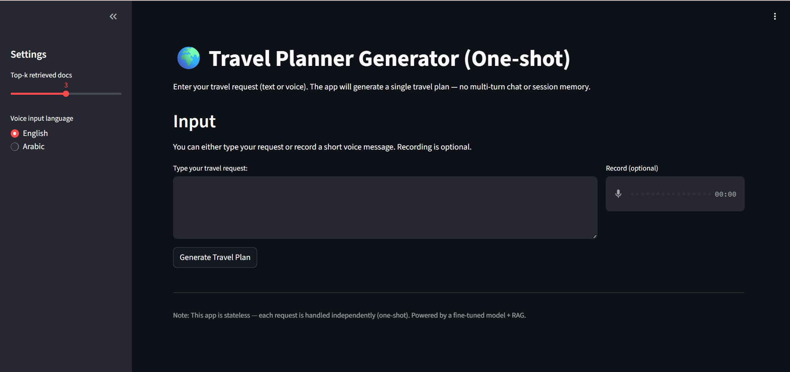

# 🌍 TravelPlanner AI — Voice-Enabled RAG Chatbot




[]()
[]()
[]()


**TravelPlanner AI** is an intelligent travel planning assistant that combines **Retrieval-Augmented Generation (RAG)**, a **fine-tuned Qwen LLM**, and **Automatic Speech Recognition (ASR)** to deliver a natural conversational experience for planning trips.

💡 Users can type queries **or speak directly via mic**. The system retrieves relevant knowledge, applies prompt-engineered reasoning, and generates coherent, multi-day itineraries with justifications.


## 🎬 Demo
**👉 [Watch the demo on Google Drive](https://drive.google.com/drive/folders/1UDbOqPE_RFlPLKKdtfu6Qw3gjxWb5LEO?usp=sharing)**
---


## Note-Book1 Colab
**👉 [Colab](https://colab.research.google.com/drive/1elbaJdaQBlaFkHz_9r_CBugavxag9AcP?usp=sharing)**
---

## Note-Book2 Colab
**👉 [Colab](https://colab.research.google.com/drive/172EMHjNXYVbNFh88my7w87XKpvJyIQBe?usp=sharing)**
---

## ✨ Features

- 🎤 **Voice-to-Text Input**
  - Powered by **GoogleAPi/ SpeechRecognition API**.
  - Multilingual (English, Arabic, +100 more).
  - Real-time transcription integrated with the chat box.

- 🧠 **RAG (Retrieval-Augmented Generation)**
  - Embeddings via `sentence-transformers/all-MiniLM-L6-v2`.
  - Vector search powered by **FAISS**.
  - Retrieves top-k travel knowledge and injects it into prompts.

- 🤖 **LLM Core**
  - Baseline: **Qwen2.5-0.5B-Instruct**.
  - another_model: **HuggingFaceH4/zephyr-7b-beta**.
  - Fine-tuned on the **[OSU NLP TravelPlanner dataset](https://huggingface.co/datasets/osunlp/TravelPlanner)**.
  - Supports few-shot prompting for richer suggestions.

- 💻 **UI/UX**
  - Built with **Streamlit**.
  - **One-Shot-style interface** with text box + mic icon.
  - Recording bar slides in when mic is active.
  - Responses shown with retrieved context side-by-side.

---

## 🏗️ System Architecture
🎙️ Speech / ⌨️ Text → ASR → Preprocess → Embeddings → FAISS (top-k)
↘ Prompt Builder (few-shot + context)
→ Qwen (LoRA/FT) → ✨ Itinerary + Justification


---

## 📦 Installation

```bash
git clone https://github.com/your-username/TravelPlanner-AI.git
cd TravelPlanner-AI

# (Recommended) create a virtual environment
python -m venv .venv
source .venv/bin/activate  # Windows: .venv\Scripts\activate

# Install dependencies
pip install -r requirements.txt
-----------------------------------------------
Main Requirements
streamlit
torch (CUDA if available)
transformers, accelerate, peft
sentence-transformers, datasets
faiss-cpu
faster-whisper or SpeechRecognition + pydub
pyngrok (optional, for Colab tunneling)

!pip install pyngrok
from pyngrok import ngrok
public_url = ngrok.connect(8501)
print("App URL:", public_url)
!streamlit run app.py --server.port 8501 --server.address 0.0.0.0

---------------------------

TravelPlanner-AI/
├── app.py                 # Streamlit UI (chat + mic + results)
├── run_app.py             # Launch Streamlit + expose via ngrok
├── rag_system.py          # RAG pipeline (embeddings, FAISS, prompt)
├── voice_processing.py    # ASR helpers (Whisper / Google SR)
├── data_preprocessing.py  # Text normalization & dataset prep
├── model_training.py      # LoRA fine-tuning (bitsandbytes)
├── requirements.txt
├── travelplanner_architecture.png
└── README.md
----------------------------


Developed by
Mohamed Maher 
Mahmoud Saeed 
Amr Saeed 
Abdelrahman Mohamed Ali 
For AI/NLP learning & experimentation.
